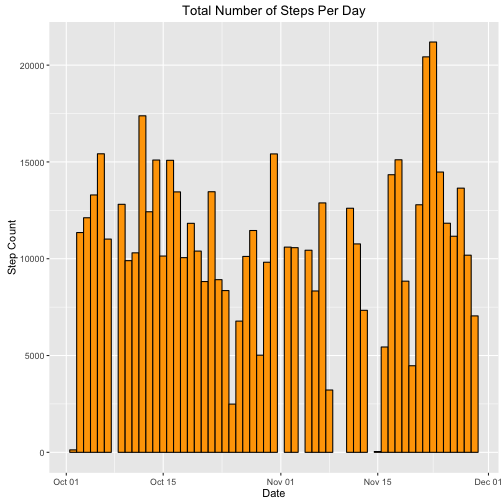
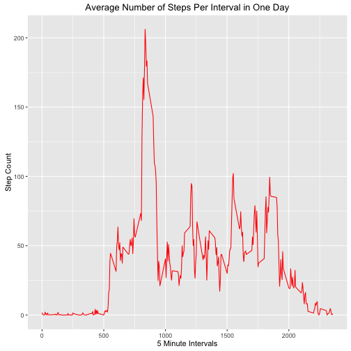
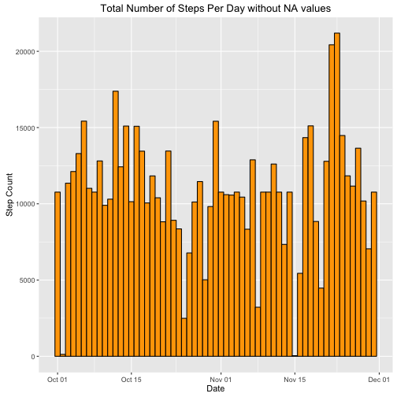
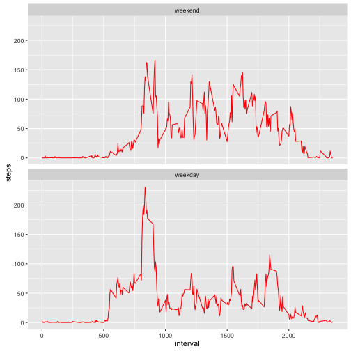

# Peer-Graded Assignment: Coursera Project 1
echo = TRUE

### Part 1 -- Loading & Processing Data

FYI -- Assuming working directory is set and data unzipped.

```r
Activity <- read.csv("~/datasciencecoursera/Reproducible Research/activity.csv")
Activity$date <- as.Date(Activity$date)
NAfree <- na.omit(Activity)
```
### PART 2 -- Total Number of Steps Per Day


```r
Total.Steps <- aggregate(steps ~ date, data = NAfree, FUN = sum)

library(ggplot2)

ggplot(data = Total.Steps, aes(x = date, y = steps)) + 
geom_bar(stat = "identity", color = "black", fill = "orange", width = 1) + xlab("Date") +
ylab("Step Count") + ggtitle("Total Number of Steps Per Day")
```



```r
mean(Total.Steps$steps)
```

```
## [1] 10766.19
```

```r
median(Total.Steps$steps)
```

```
## [1] 10765
```

```r
summary(Total.Steps)
```

```
##       date                steps      
##  Min.   :2012-10-02   Min.   :   41  
##  1st Qu.:2012-10-16   1st Qu.: 8841  
##  Median :2012-10-29   Median :10765  
##  Mean   :2012-10-30   Mean   :10766  
##  3rd Qu.:2012-11-16   3rd Qu.:13294  
##  Max.   :2012-11-29   Max.   :21194
```
Mean = 10766.19  
Median = 10765  
Summary: Mean = 10766 (rounded to whole number); Median = 10765  

### PART 3 -- Average Daily Activity Pattern 


```r
Mean.Steps <- aggregate(steps ~ interval, data = NAfree, FUN = mean)

ggplot(data = Mean.Steps, aes(x = interval, y = steps)) + geom_line(color = "red") + xlab("5 Minute Intervals") + ylab("Step Count") + 
ggtitle("Average Number of Steps Per Interval in One Day")
```



```r
Mean.Steps[Mean.Steps$steps == max(Mean.Steps$steps), ]
```

```
##     interval    steps
## 104      835 206.1698
```
### PART 4 -- Inputting Missing Values

Replace NA values in the Activity dataframe with the mean-step values per interval from the Mean.Steps dataframe.


```r
nrow(Activity[Activity$steps == "NA", ])
```

```
## [1] 2304
```

```r
Activity$steps <- ifelse(is.na(Activity$steps) == TRUE, 
Mean.Steps$steps[Mean.Steps$interval %in% Activity$interval], Activity$steps)

Total.Steps2 <- aggregate(steps ~ date, data = Activity, FUN = sum)

ggplot(data = Total.Steps2, aes(x = date, y = steps)) + 
geom_bar(stat = "identity", color = "black", fill = "orange", width = 1) + xlab("Date") + ylab("Step Count") + ggtitle("Total Number of Steps Per Day without NA values")
```



```r
mean(Total.Steps2$steps)
```

```
## [1] 10766.19
```

```r
median(Total.Steps2$steps)
```

```
## [1] 10766.19
```

```r
summary(Total.Steps2)
```

```
##       date                steps      
##  Min.   :2012-10-01   Min.   :   41  
##  1st Qu.:2012-10-16   1st Qu.: 9819  
##  Median :2012-10-31   Median :10766  
##  Mean   :2012-10-31   Mean   :10766  
##  3rd Qu.:2012-11-15   3rd Qu.:12811  
##  Max.   :2012-11-30   Max.   :21194
```
Mean & Median = 10766.19 now.    
Summary function: both Mean & Median = 10766  

### PART 5 -- Any Difference in Activity Patterns Between Weekends & Weekdays


```r
Activity$wDay <- factor(weekdays(Activity$date))
levels(Activity$wDay) <- list(weekend = c("Saturday", "Sunday"), weekday = c("Monday", "Tuesday", "Wednesday", "Thursday", "Friday"))

Mean.Steps2 <- aggregate(steps ~ interval + wDay, data = Activity, FUN = mean)

ggplot(data = Mean.Steps2, aes(x = interval, y = steps)) + geom_line(color = "red") + facet_wrap(~ wDay, ncol = 1)
```


 
